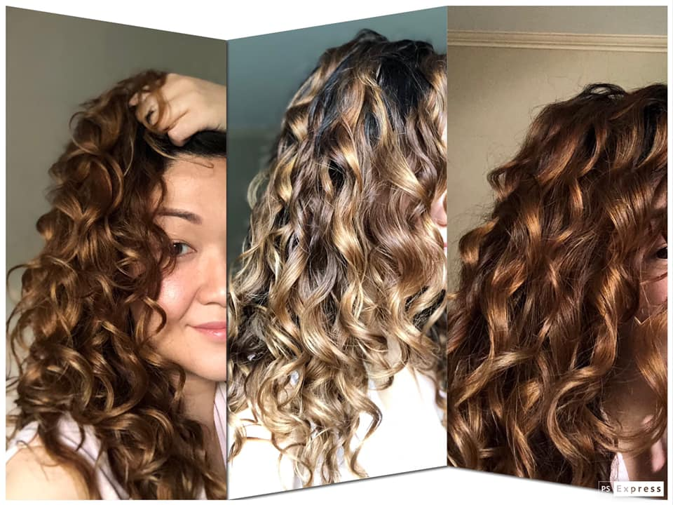

Here in the Philippines, having hair other than straight is out of the norm. A lot of girls I've known since I was younger have had their hair straightened at least once, and some even regularly at once or twice a year. Even I have had my hair straightened twice before that left my hair deeply damaged for a long time.

One of those girls is Vanessa. Last time I saw her about a year ago, she just had her hair rebonded for what she said felt like the hundredth time. Last January, she read a feature on how another curly girl revived her curls and from then on, she was hooked. She has been doing the Curly Girl Method, a method developed by Lorraine Massey specifically to care for curly hair, for a little over three months now. From the pictures she occasionally posts on Facebook, it seems like CGM is doing her good. I myself have been doing it for the past couple of weeks and while there haven't been any dramatic change, I can see that my hair is looking better than it was before I started.

> "She’s  curly too and it really broke my heart knowing I was showing her by my example that I did not think our curls were beautiful."

Weesa, a moderator from the Curly Girl PH Facebook group, had a different reason. It was her daughter that made her decide to not schedule another hair straightening appointment. When asked why, she said "she’s curly too and it really broke my heart knowing I was showing her by my example that I did not think our curls were beautiful." Then a friend introduced her to CGM, and once she had a solid grasp of the concept, she started praciting it around October.

It's not an overnight success, and of course, trying something new will always involve trial and error. Vanessa found it difficult to justify the amount of product and plastic waste she has to go through while doing this method. To make up for this, she says that she mostly tries "to reuse or upcycle everything and ecobrick the ones that can’t be used." For Weesa, it took about 3 to 4 months of consistently doing CGM for her to notice stark changes. The challenges she faced were not just about products, but according to her, it was also "having to unlearn years of faulty hair care advice and society’s media driven beauty ideals, but everyday, practice becomes habit, until you eventually live your advocacy." 

*Weesa at 5 months practicing CGM. Used with permission.*

But the rewards sure outweigh any challenges. Although the recovery doesn't happen overnight, any progress is still progress. Although she can't help but compare her progress to others, Weesa says that having a strong support system of people going through the same transition makes a difference. For her, the progress goes deeper than just hair. She says that "you’ll see your whole outlook on self acceptance and confidence change too. You become more forgiving of your faults and kinder to yourself, and you find yourself being more generous and accepting of others too."

> "You’ll see your whole outlook on self acceptance and confidence change too. You become more forgiving of your faults and kinder to yourself, and you find yourself being more generous and accepting of others too."

When asked what tips or advice they would give to a CGM newbie, Vanessa says to "be patient and listen to your hair". Curly Girl Method is not a one-size-fits-all. The goal is to recover from all the damage and have healthy hair, then the natural curls will follow. Weesa advices the same, to "focus on getting your hair healthy, the curls and aesthetics will follow with patience, time and consistency." She also recommends to take lots of progress photos, as it helps to keep your spirits up during bad days. Learn about the method as much as possible to know what to expect, and allow yourself to invest in self-care.

Lastly, although it helps to have a support group, she says not to expect your progress to be like everyone elses because **"all our curls are unique, just like our journeys."**